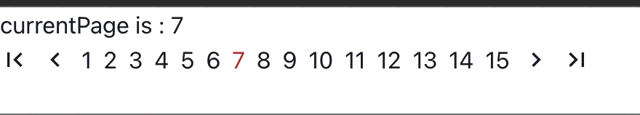
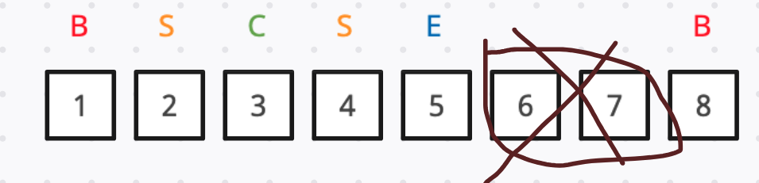
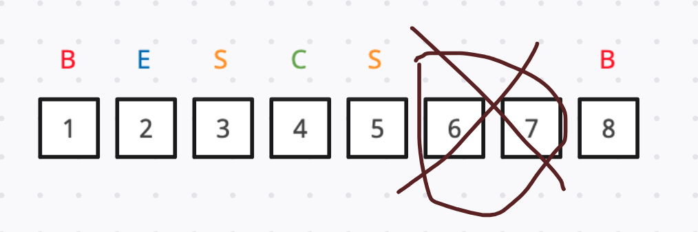
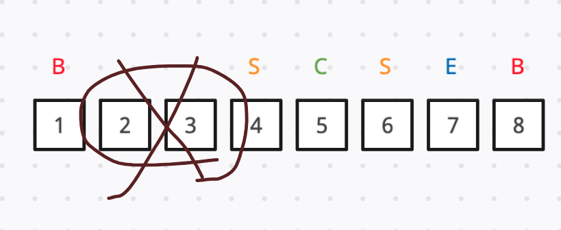
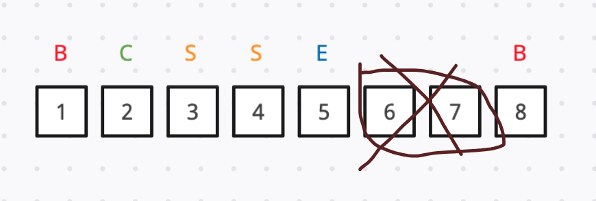
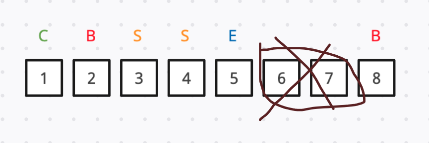
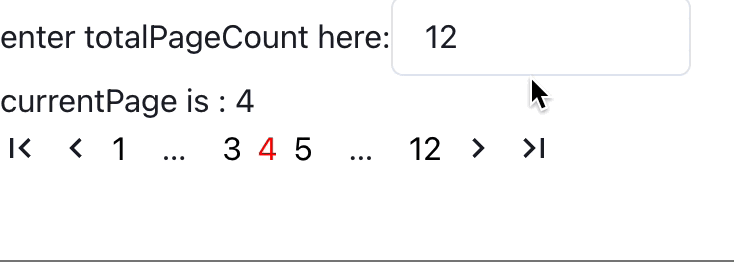

In this article, I record steps I took to implement a state-controlled Pagination component from scratch using React, Vite, ChakraUI and react-icons.

### TL:DR

- Project setting
- Design Pagination props
- Code our Pagination
- When to show the break label
- Wrap up
- References

## Project setting

To start our project, let’s use React + vite as our starter kit. As for the UI library, I am going to choose ChakraUI. And the icons will use react-icons md ( Material Design Icons ).

```bash
# terminal

# install React
$ npm create vite@latest
$ cd YOUR_PROJECT
$ npm i

# install ChakraUI
$ npm i @chakra-ui/react @emotion/react @emotion/styled framer-motion

# install react-icons
$ npm install react-icons --save
```

After installing all packages, let’s do a little bit of config.

In our `main.tsx` , wrap our App with `ChakraProvider` .

```tsx
// src/main.tsx

import React from "react";
import ReactDOM from "react-dom/client";
import App from "./App.tsx";

import { ChakraProvider } from "@chakra-ui/react";

ReactDOM.createRoot(document.getElementById("root")!).render(
  <React.StrictMode>
    <ChakraProvider>
      <App />
    </ChakraProvider>
  </React.StrictMode>
);
```

Next step, create a file called `Pagination.tsx` which will be our Pagination component.

```tsx
// src/Pagination.tsx

import { Box } from "@chakra-ui/react";

const Pagination = () => {
  return <Box>this is pagination</Box>;
};

export default Pagination;
```

We are going to import Pagination into `App.tsx` :

```tsx
// src/App.tsx

import Pagination from "./Pagination";

function App() {
  return (
    <>
      hi <Pagination />
    </>
  );
}

export default App;
```

After all basic settings, our project tree should now looks like this:

```tsx
.
├── README.md
├── index.html
├── package-lock.json
├── package.json
├── src
│   ├── App.tsx
│   ├── Pagination.tsx
│   ├── main.tsx
│   └── vite-env.d.ts
├── tsconfig.json
├── tsconfig.node.json
└── vite.config.ts
```

## Design Pagination props

Let’s use MUI Pagination as our reference, your can try the [MUI demo](https://mui.com/material-ui/react-pagination/#buttons) in order to get deeper understanding on what we are going to discuss later.


As the image shown above, the component can break into 5 parts:

1. firstPageButton: when clicked, go back to page 1 
2. previousPageButton: when clicked, go back to a page before
3. pageList: all the page numbers, including the `...` break label
4. nextPageButton: when clicked, go to next page 
5. lastPageButton: when clicked, go to last page

And…

Let’s look deeper into “pageList”, it can break into 4 parts:

1. boundary pages: which is page 1 and page 10 in the above image
2. breakLabel: which is `...`  in the above image.
3. sibling pages: which is page 4 and page 6 in the above image.
4. currentPage: which is page 5 in the above image.

To enable the parent to fully control the Pagination, the Pagination should expose these props to the parent:

```tsx
// App.tsx

import { useState } from "react";
import Pagination from "./Pagination";

function App() {
	const totalPageCount = 15;

  const [currentPage, setCurrentPage] = useState(1);
  const onPageChange = (nextPage: number) => {
    setCurrentPage(nextPage);
  };

  return (
    <>
      currentPage is : {currentPage}
      <Pagination
        totalPageCount={totalPageCount}
        currentPage={currentPage}
        onChange={onPageChange}
        // siblingCount={1}
        // boundaryCount={1}
        // showFirstButton={true}
        // showLastButton={true}
        // showNextButton={true}
        // showPrevButton={true}
      />
    </>
  );
}

export default App;
```

For the parent, the very first thing it should do is to tell the Pagination the total page it has to generate by passing down `totalPageCount` .

As to control the page change event, declare a react-state which store the `currentPage` value, and a `onPageChange` handler which will receive the “next-page number” and set it to the `currentPage` state. By passing the `currentPage` and `onPageChange` handler down to Pagination, the parent should have control over the page change event and its rendering of the current page.

So, our Pagination props type should look like this:

```tsx
type PaginationProps = {
  totalPageCount: number;
  currentPage: number;
  onChange: (page: number) => void;
  siblingCount?: number;
  boundaryCount?: number;
  showFirstButton?: boolean;
  showLastButton?: boolean;
  showNextButton?: boolean;
  showPrevButton?: boolean;
}
```

1. `totolPageCount` : should be a positive integer number, allows Pagination to know how many pages it has to generate. In real life project, it usually comes from data received from the server. 
2. `currentPage` : should be a react-state passed from parent, telling Pagination which page is currently active.
3. `onChange` : an event triggered whichever the button is clicked, noted that `onChange` should receive the “next-page number” as param.
4. `siblingCount` : For example, if `currentPage` is 8, while `siblingCount` is 2, the left and right siblings page will be 6, 7, 9 and 10. Optional.
5. `boundaryCount` : For example, if `boundaryCount` is 2, while `totalPageCount` is 10, the left and right boundary pages will be page 1, 2, 9 and 10. Optional.
6. the rest four booleans pretty much demonstrate their purpose by their names. Also Optional.

With the props above, our parent can now fully control the Pagination.

## Code our Pagination

After parent and props of Pagination are all settled , let’s start writing some code in `Pagniation.tsx`:

```tsx
// Pagination.tsx

import { Box, Flex } from "@chakra-ui/react";
import {
  MdFirstPage,
  MdLastPage,
  MdNavigateBefore,
  MdNavigateNext,
} from "react-icons/md";

const Pagination = (props: PaginationProps) => {
  const {
    totalPageCount,
    currentPage,
    onChange,
    // siblingCount = 1,
    // boundaryCount = 1,
    showFirstButton = true,
    showLastButton = true,
    showNextButton = true,
    showPrevButton = true,
  } = props;

  const pageList = Array.from({ length: totalPageCount }, (_, i) => i + 1);
  const firstPage = 1;
  const lastPage = totalPageCount;

  const onNavigateToFirstPage = () => {
    if (currentPage === 1) return;
    onChange(firstPage);
  };

  const onNavigateToPreviousPage = () => {
    if (currentPage === 1) return;
    onChange(currentPage - 1);
  };

  const onNavigateToNextPage = () => {
    if (currentPage === lastPage) return;
    onChange(currentPage + 1);
  };

  const onNavigateToLastPage = () => {
    if (currentPage === lastPage) return;
    onChange(lastPage);
  };

  return (
    <Flex alignItems={"center"} gap={2}>
      {showFirstButton && (
        <Box onClick={onNavigateToFirstPage}>
          <MdFirstPage size={20} />
        </Box>
      )}
      {showPrevButton && (
        <Box onClick={onNavigateToPreviousPage}>
          <MdNavigateBefore size={20} />
        </Box>
      )}
      {pageList.length !== 0 &&
        pageList.map((page) => (
          <Box onClick={() => onChange(page)} key={page}>
            {page}
          </Box>
        ))}
      {showNextButton && (
        <Box onClick={onNavigateToNextPage}>
          <MdNavigateNext size={20} />
        </Box>
      )}
      {showLastButton && (
        <Box onClick={onNavigateToLastPage}>
          <MdLastPage size={20} />
        </Box>
      )}
    </Flex>
  );
};

export default Pagination;
```

Let me explain what have been done above:

First, we use `Array.from` to create an array of numbers based on the `totalPageCount` passed in, it can later be used to render a list of number as our page buttons.

Second, add `onClick` events to each button, passing the correspond page number to the `onChange` callback passed from the parent.

Third, there should be some limitation on “first-page button”, “previous-page button”, “next-page button”. For example, when we are in page 1, the “first-page button” and “previous-page button” should be disabled because there is no previous page to go. Add these limitations to the `onClick` on the above buttons. 

Now our Pagination should function well:



## When to show the break label?

Up until now, our Pagination is actually done …?, 

Well, partially, it functions well as the above gif shows, BUT, you might be thinking, what if the `totalPageCount` is 100, should we show all 100 pages on screen? No, that’s definitely not what we want. 

So, how do we deal with that? 

Some people have come up with a smart way to solve this problem: only show the crucial pages we need to see, that is, the “boundary-pages”, “sibling-pages” and “current-page”, while the rest parts, hide it, show the “break-label” as placeholder instead.


To achieve that, we need to do some calculation to our `pageList`.

What we will do, is to implement a `usePaginationList` hook, which takes in `totalPageCount` , `currentPage` , `siblingCount` and `boundaryCount` as params, and return a list for us. The list should look something like this:

 `[1, <BreakLabel />, 4, 5, 6, <BreakLabel />, 9]`

An array which contains all we need to render as `pageList` on screen: the “should-show” page numbers and the “break-label” for the rest “should-hide” parts.

Our Pagination code will look like this:

```tsx
// Pagination.tsx

const Pagination = (props: PaginationProps) => {
  const {
    totalPageCount,
    currentPage,
		onChange,
    siblingCount = 1,
    boundaryCount = 1,
    ...
  } = props;

  const pageList = usePaginationList({
    totalPageCount,
    currentPage,
    siblingCount,
    boundaryCount,
  });
  const firstPage = 1;
  const lastPage = totalPageCount;

	...

  return (
    <Flex alignItems={"center"} gap={2}>
      ...
			{pageList.map((item, idx) => {
        return typeof item === "number" ? (
          <Box
            key={item}
            onClick={() => onChange(item)}
          >{item}</Box>
        ) : (
          <Fragment key={`${idx} + breakLabel`}>{item}</Fragment>
        );
      })}
      ...
    </Flex>
  );
};

export default Pagination;
```

Iterate over the `pageList` return by the `usePaginationList` hook, render the page number if the type of list item is number, or else we render the item as JSX element, which will be the “break-label” component. 

### `BreakLabel` component and `genArrayOfNumbers` function

Before we start discussing the logic behind `usePaginationList`, we can implement `<BreakLabel />` and `genArrayOfNumbers` first.

 `<BreakLabel />` will simply be a component which renders `...` on screen.

```tsx
// BreakLabel.tsx

import { Text } from "@chakra-ui/layout";

const BreakLabel = () => {
  return (
    <Text textAlign={"center"} w={8}>
      &#8230;
    </Text>
  );
};

export default BreakLabel;
```

`genArrayOfNumbers` is a helper function which takes in `startNum` and `endNum` as params, and return an array of numbers from `startNum` to `endNum` . This helper function is useful when the start number isn’t 1.

```tsx
// genArrayOfNumbers.ts

const genArrayOfNumbers = (startNum: number, endNum: number) => {
  const length = endNum - startNum + 1;
  return Array.from({ length }, (_, i) => startNum + i);
};

// for example:
console.log(genArrayOfNumbers(2, 5));
// log: [2, 3, 4, 5];
```

Having these done, we can now start our construction on `usePaginationList` hook!

### Implement `usePaginationList`

As the explanation above, the `usePaginationList` should take in 4 params: `totalPageCount` , `currentPage` , `siblingCount` and `boundaryCount` , and return a `pageList` array which contains page numbers to render and the `<BreakLabel />` , if needed.

There are 4 possible cases of combination between page numbers and break labels:

1. Showing all the pages:


1. Showing break label on the right:


1. Showing break label on the left:


1. Showing break labels on both side:


Let’s discuss conditions which trigger each cases:

### Case 1 “Showing all the pages”:

To decide whether to show all pages or not, we need to calculate the value of `maxLengthOfPageNumbersToShow`. 

If the `totalPageCount` is less or equal to this count, then there is no need to show any break label, whereas if the `totalPageCount` is larger, we will have to hide the rest page numbers, and place break label as placeholder on the UI, this is will be case 2, 3 and 4, which we will discuss later.

`maxLengthOfPageNumbersToShow` should be the sum of the length over the “left-boundary pages”, “left-sibling pages”, “current page”, “right-sibling pages”, “right-boundary pages” and an extra “1”. 

The extra 1 stands for the extra page button count to be shown between extreme sibling ( either the most left or right sibling ) and extreme boundary ( either the most left or right boundary ), it’s like a buffer, if the pages length between the two extreme buttons are larger than 1, then those page buttons will be hidden. 

This extra page button will be place next to the extreme sibling button, while it’s next to the right or left extreme sibling depends on situations:

( B: Boundary; S: Sibling; C: current; E: extra )

Fig 1



when current page is 3, the left boundary will be page 1, the sibling will be page 2 and 4, while the extra buffer page will be page 5, the rest will be hidden except for the right boundary page 8.

FIg 2



when current page is 4, the left boundary will be page 1, the sibling will be page 3 and 5, while the extra buffer page goes to page 2 because the sum of page 6 and page 7 is 2, which is greater than the buffer count 1, so those 2 pages will be hidden.

Fig 3



now the current page goes to 5, the left boundary will be page 1, the sibling will be page 4 and 6, while the extra buffer page goes to page 7 because the sum of page 2 and page 3 is 2, which is greater than the buffer count 1, so those 2 pages will be hidden.

Fig 4 & 5





you might be thinking, what if the current page is at either page 1 or 2, how do we calculate the boundary and sibling when they are overlap? Well, in these cases, we still leave spaces for the boundary and siblings, so as you can see, when current page goes to 2 or 1, pages that are hidden still goes to page 6 and 7.

---

The above diagrams should give a rather clear view on each possible situation.

Now we can implement the code for case 1:

```tsx
// usePaginationList.ts

import { useMemo } from "react";
import { genArrayOfNumbers } from "./genArrayOfNumbers";

type GenPaginationListParams = {
  totalPageCount: number;
  currentPage: number;
  siblingCount: number;
  boundaryCount: number;
};

export const usePaginationList = (params: GenPaginationListParams) => {
  const { totalPageCount, currentPage, siblingCount, boundaryCount } = params;

  const paginationList = useMemo(() => {
    const firstPage = 1;
    const lastPage = totalPageCount;

    // if totalPageCount is more than this count
    // we will have to hide some pages and show break label instead
		// 1 is for currentPage & extra buffer
    const maxLengthOfPageNumbersToShow =
      2 * boundaryCount + 2 * siblingCount + 1 + 1;

    // CASE 1: show all page numbers
    if (totalPageCount <= maxLengthOfPageNumbersToShow) {
      return genArrayOfNumbers(firstPage, lastPage);
    }
  }, [boundaryCount, siblingCount, totalPageCount]);

	// A, CASE 2 ~ 4

  return paginationList;
};
```

Count the `maxLengthOfPageNumbersToShow` first, if `totalPageCount` is less or equals to it, then we simply render all the page numbers.

Noted that we use `useMemo` to cache the return `paginationList` , since the calculation in total will be quit heave, and Pagination is likely to be re-used often, so it’s better to cache the return value with `useMemo` .

### Case 2, 3, and 4:

If the condition reaches `// A` , it means we need to start placing break label into the `pageList`. 

We are going to discuss case 2, 3, and 4 together, since they all show break label, the differences between each cases is “where” they place the break label.

Before writing some detail logic, let’s see what our final code are going look like:

```tsx
// usePaginationList.ts
import BreakLabel from "./BreakLabel";

...

export const usePaginationList = (params: GenPaginationListParams) => {
  const { totalPageCount, currentPage, siblingCount, boundaryCount } = params;

  const paginationList = useMemo(() => {
		...

		// CASE 1: show all page numbers
    if (totalPageCount <= maxLengthOfPageNumbersToShow) {
      return genArrayOfNumbers(firstPage, lastPage);
    }

		// A, CASE 2 ~ 4 starts from here

		const shouldShowLeftBreakLabel: boolean = ...
    const shouldShowRightBreakLabel: boolean = ...

    // CASE 2: show right break label
    if(!shouldShowLeftBreakLabel && shouldShowRightBreakLabel){
      const leftPages = ...
      const rightBoundaryPages = ...
      return [...leftPages, <BreakLabel />, ...rightBoundaryPages];
    }

    // CASE 3: show left break label
    if (shouldShowLeftBreakLabel && !shouldShowRightBreakLabel) {
      const leftBoundaryPages = ...
      const rightPages = ...
      return [...leftBoundaryPages, <BreakLabel />, ...rightPages];
    }

    // CASE 4: show break labels on both side
    if (shouldShowLeftBreakLabel && shouldShowRightBreakLabel) {
      const leftBoundaryPages = ...
      const rightBoundaryPages = ...
      const middlePages = ...
      return [
				...leftBoundaryPages, 
				<BreakLabel />, 
				...middlePages, 
				<BreakLabel />, 
				...rightBoundaryPages
			];
    }

  return paginationList;
};
```

The above code should explain quit clear on what we are going to implement.

Declare 2 booleans, `shouldShowLeftBreakLabel` and `shouldShowRightBreakLabel` , which will help us decide where to place our break label ( CASE 2 ~ 4 ).

In each cases, place break label into the returned `pageList` according to the condition. For example, in CASE 2, if the break label is designated to the right, then the returned array should look like this:

```tsx
return [...leftPages, <BreakLabel />, ...rightBoundaryPages];
```

And what is `leftPages` ? It will be “left-boundary pages” + “left-sibling pages” + “right-sibling pages” + “current page” + “extra buffer”.

So, as you may deduce, `rightPages` will be “right-boundary pages” + “left-sibling pages” + “right-sibling pages” + “current page” + “extra buffer”, while `middlePages` will be “left-sibling pages” + “current page” + “right-sibling pages”, it excludes “extra buffer” because in this case we put break label on both side.

Now, what about `shouldShowLeftBreakLabel` and `shouldShowRightBreakLabel` ? Well, the 2 booleans can be deduced simply by checking if the pages length between the extreme boundary page and the extreme sibling page is more than 1, then there should be a break label:

```tsx

const leftExtremeBoundary = boundaryCount;
const rightExtremeBoundary = lastPage - boundaryCount + 1;

// we are using Math.max and Math.min to 
// make sure the extreme sibling won't exceed our boundary
const leftExtremeSibling = Math.max(currentPage, currentPage - siblingCount);
const rightExtremeSibling = Math.min(currentPage, currentPage + siblingCount);

const extraBufferLength = 1;

const shouldShowLeftBreakLabel: boolean = leftExtremeBoundary + extraBufferLength < leftExtremeSibling
const shouldShowRightBreakLabel: boolean = rightExtremeSibling + extraBufferLength < rightExtremeBoundary;
```

Knowing all the detail logic, let’s finish our code for CASE 2 ~ 4:

```tsx
const extraBufferLength = 1;
const currentPageLength = 1;

// CASE 2: show right break label
if (!shouldShowLeftBreakLabel && shouldShowRightBreakLabel) {
  const leftPagesLength =
    boundaryCount +
    siblingCount * 2 +
    currentPageLength +
    extraBufferLength;
  const leftPages = genArrayOfNumbers(firstPage, leftPagesLength);
  const rightBoundaryPages = genArrayOfNumbers(
    lastPage - boundaryCount + 1,
    lastPage
  );

  return [...leftPages, BreakLabel(), ...rightBoundaryPages];
}

// CASE 3: show left break label
if (shouldShowLeftBreakLabel && !shouldShowRightBreakLabel) {
  const leftBoundaryPages = genArrayOfNumbers(firstPage, boundaryCount);
  const rightPagesStart =
    lastPage - siblingCount * 2 - boundaryCount + 1 - extraBufferLength;
  const rightPages = genArrayOfNumbers(rightPagesStart, lastPage);

  return [...leftBoundaryPages, BreakLabel(), ...rightPages];
}

// CASE 4: show break labels on both side
if (shouldShowLeftBreakLabel && shouldShowRightBreakLabel) {
  const leftBoundaryPages = genArrayOfNumbers(firstPage, boundaryCount);
  const rightBoundaryPages = genArrayOfNumbers(
    lastPage - boundaryCount + 1,
    lastPage
  );
  const middlePages = genArrayOfNumbers(
    currentPage - siblingCount,
    currentPage + siblingCount
  );
  return [
    ...leftBoundaryPages,
    BreakLabel(),
    ...middlePages,
    BreakLabel(),
    ...rightBoundaryPages,
  ];
}
```

## Wrap up

Voilà! Our pagination should now work well.

If you are interested in the complete code base, here’s the [repo](https://github.com/alexyin0978/build-your-own-pagination).

And here’s the [demo link](https://build-your-own-pagination.vercel.app/), feel free to try.

Thanks for reading 🎉



## References

1. [MUI Pagination](https://mui.com/material-ui/react-pagination/)
2. [How to Build a Custom Pagination Component in React](https://www.freecodecamp.org/news/build-a-custom-pagination-component-in-react/)